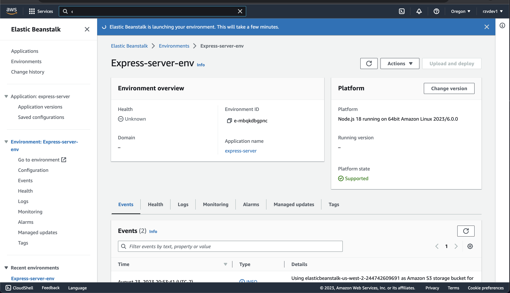
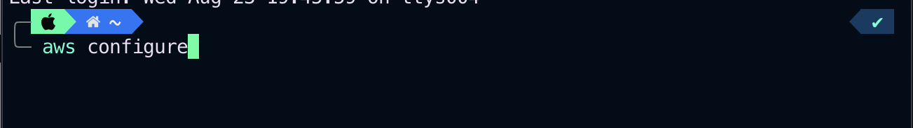
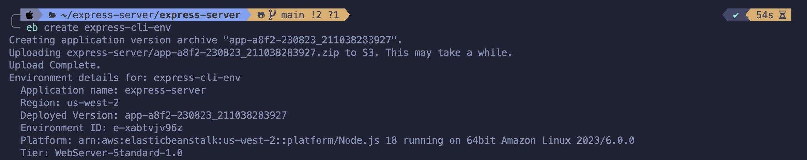
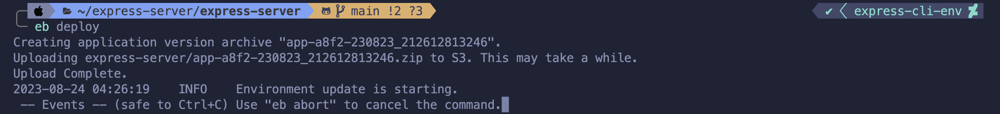
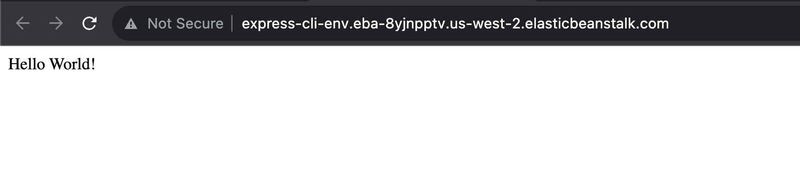

# AWS: Cloud Servers

## Overview

This is a simple project to demonstrate how to create a cloud server on AWS. The project uses the AWS CLI to create a cloud server and then uses Elastic Beanstalk to deploy a simple web application.

## Getting Started

The following steps will get you started.

1. Clone express server repository 
2. Create an AWS account 
3. Create Elastic Beanstalk application 
4. Install AWS CLI
   `$brew install awscli`
   
5. Configure AWS CLI 

6. Create eb environment
   `$eb create`
   
7. Deploy application 

### final result

[MIT License](LICENSE) @ Julio Ramirez
