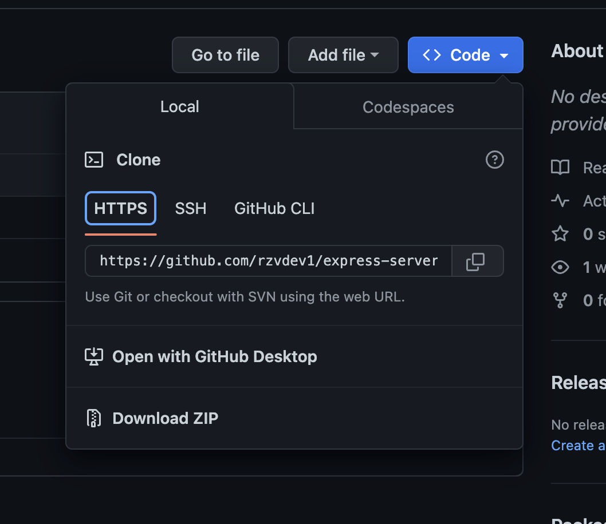
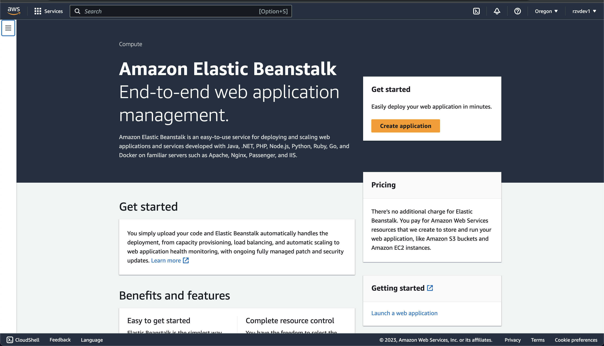
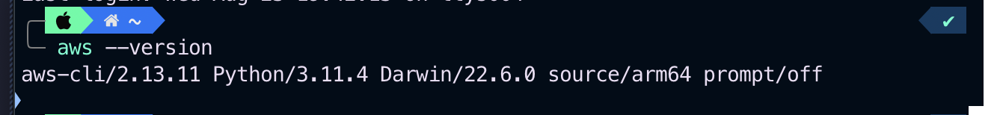

# AWS: Cloud Servers

## Overview

This is a simple project to demonstrate how to create a cloud server on AWS. The project uses the AWS CLI to create a cloud server and then uses Elastic Beanstalk to deploy a simple web application.

## Getting Started

The following steps will get you started.

1. Clone express server repository 
2. Create an AWS account 
3. Elastic Beanstalk to deploy an application 
4. Install AWS CLI
   `$brew install awscli`
   
5. Configure AWS CLI
6. Create a key pair
7. Create a security group
8. Create an instance
9. Deploy application

[MIT License](LICENSE) @ Julio Ramirez
